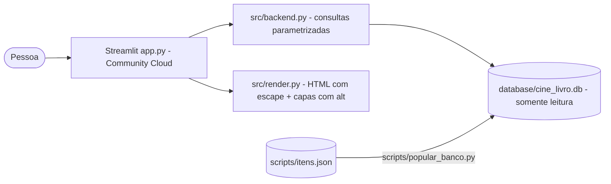

# Arquitetura — Cine&Livro

## Modelo de dados

| Coluna | Tipo | Regra |
|---|---|---|
| id | INTEGER | PK |
| titulo, descricao, imagem, categoria | TEXT | NOT NULL |
| tipo | TEXT | CHECK ('Filme', 'Livro') |
| índice | (tipo, categoria) | acelera os filtros |

## ADRs

| # | Decisão | Motivo | Alternativa |
|---|---|---|---|
| ADR-01 | Manter Streamlit + SQLite | Decisão do usuário; catálogo pequeno e só leitura | API + SPA |
| ADR-02 | Função `normalizar` registrada no SQLite | Busca sem acento sem coluna extra | Coluna normalizada |
| ADR-03 | Capas em data URI dentro do card | `st.image` não aceita texto alternativo | Servir `assets/` como estático |
| ADR-04 | `itens.json` como fonte da verdade; `.db` gerado | Fácil de editar e revisar em PR | Editar o `.db` direto |
